# Smart Plant Factory Automation V2

這是一個基於 Python 2.7 的自動化控制系統，用於管理植物工廠的 LED 照明與馬達循環。

## 功能特色
- **自動排程控制**：使用 `APScheduler` 進行精確的任務排程。
- **LED 控制**：根據設定的時間區間自動開關植物燈。
- **馬達控制**：管理馬達的運轉與休息循環。
- **Docker 化部署**：支援容器化執行，方便部署。

## 環境需求
- Python 2.7
- MariaDB / MySQL
- Docker (選用)

## 安裝與執行

### 1. 安裝依賴套件
```bash
cd python
pip install -r requirements.txt
```

### 2. 設定環境變數
請複製 `.env.sample` 為 `.env` 並填入資料庫連線資訊：
```bash
cp .env.sample .env
# 編輯 .env 檔案填入 DB_HOST, DB_USER, DB_PASSWD, DB_NAME
```

### 3. 執行程式
直接執行 `main.py` 即可啟動排程器：
```bash
python main.py
```
程式啟動後會持續運行，並在終端機顯示執行日誌與時間戳記。

## 排程設定
目前的排程設定如下 (於 `main.py` 中定義)：
- **LED 控制任務 (`run_led_control`)**: 每 **10 分鐘** 執行一次 (00, 10, 20, 30, 40, 50 分)。
- **馬達控制任務 (`run_motor_control`)**: 每 **10 分鐘** 執行一次 (00, 10, 20, 30, 40, 50 分)。

> 注意：馬達的倒數計時邏輯會依賴此執行頻率。

## 測試
本專案包含單元測試，位於 `tests/` 目錄下。
如需執行測試 (需安裝 `mock` 套件)：
```bash
cd python
python -m unittest discover tests
```

## Docker 部署
使用 Docker Compose 啟動服務：
```bash
docker-compose up --build -d
```

---

## 系統架構圖

```mermaid
---
config:
  layout: elk
---
flowchart LR
 subgraph Software["軟體架構"]
    direction LR
        PythonApp["🐍 Python 程式<br>(自動控制邏輯核心/排程)"]
        PhpWeb["🌐 PHP 網頁<br>(數據顯示與儀表板)"]
  end
 subgraph PC_System["🖥️ 監控主機 (PC)"]
    direction TB
        Software
  end
 subgraph IO_Control["⚙️ 現場控制層"]
        Moxa["Moxa 主控制器<br>(I/O 資料採集與驅動)"]
  end
 subgraph Inputs["📡 輸入端: 感測器"]
    direction TB
        pHSensor["PH 酸鹼值感測器"]
        ECSensor["EC 電導率感測器"]
        LightSensor["光強度感測器<br>(NEW!)"]
        TempSensor["室溫感測器<br>(NEW!)"]
        HumidSensor["濕度感測器<br>(NEW!)"]
  end
 subgraph Pumps["蠕動幫浦群"]
    direction TB
        DosePump1["幫浦 1 (A液)"]
        DosePump2["幫浦 2 (B液)"]
        DosePump3["幫浦 3 (酸液)"]
        DosePump4["幫浦 4 (鹼液)"]
  end
 subgraph DosePumps["養液滴定模組"]
    direction TB
        NutrientBottles["養液瓶組 (原液)"]
        Pumps
  end
 subgraph Outputs["⚙️ 輸出端: 執行器"]
    direction TB
        RelayMainPump["繼電器 (主循環)"]
        RelayLight["繼電器 (植物燈)"]
        MotorLift["升降馬達<br>(NEW! 燈光高度)"]
        RelayMist["繼電器<br>(NEW! 水霧機)"]
        DriverDose["蠕動幫浦驅動板"]
        DosePumps
  end
 subgraph Environment["💧 實體水耕環境"]
    direction LR
        Reservoir["主儲水箱 (養液池)"]
        MainPump["主循環馬達"]
        GrowTray["定植槽"]
        GrowLight["植物生長燈"]
        MistNozzle["噴霧頭/造霧機<br>(NEW!)"]
  end
    PythonApp -. 寫入數據/狀態 .-> PhpWeb
    Moxa <== 通訊 (讀取/下令) ==> PythonApp
    pHSensor -- 訊號 --> Moxa
    ECSensor -- 訊號 --> Moxa
    LightSensor -- 訊號 --> Moxa
    TempSensor -- 訊號 --> Moxa
    HumidSensor -- 訊號 --> Moxa
    Moxa -- DO (數位輸出) --> RelayMainPump
    Moxa -- DO (定時開關) --> RelayLight
    Moxa -- DO/PWM --> DriverDose
    Moxa -- DO/Motor (控制高度) --> MotorLift
    Moxa -- DO (濕度控制) --> RelayMist
    DriverDose --> DosePumps
    RelayMainPump -. 電力 .-> MainPump
    RelayLight -. 電力 .-> GrowLight
    MotorLift -. 機械升降 .-> GrowLight
    RelayMist -. 電力 .-> MistNozzle
    MistNozzle -. 噴灑水霧 (控制溫度) .-> GrowTray
    DosePumps -. 滴定管線 .-> Reservoir
    Reservoir == 水流 ==> MainPump
    MainPump == 水流 ==> GrowTray
    GrowTray == 回流 ==> Reservoir
    NutrientBottles == 吸取 ==> DosePump1 & DosePump2 & DosePump3 & DosePump4
    GrowLight -. 光照 .-> GrowTray
    GrowTray -. 環境數據 .-> TempSensor & HumidSensor & LightSensor
    Reservoir -. 探針 .-> pHSensor & ECSensor

     PythonApp:::python
     PhpWeb:::php
     Moxa:::moxa
     pHSensor:::sensor
     ECSensor:::sensor
     LightSensor:::newFeature
     LightSensor:::newFeature
     TempSensor:::newFeature
     TempSensor:::newFeature
     HumidSensor:::newFeature
     HumidSensor:::newFeature
     DosePump1:::actuator
     DosePump2:::actuator
     DosePump3:::actuator
     DosePump4:::actuator
     NutrientBottles:::physical
     RelayMainPump:::actuator
     RelayLight:::actuator
     MotorLift:::newFeature
     RelayMist:::newFeature
     DriverDose:::actuator
     Reservoir:::physical
     MainPump:::physical
     GrowTray:::physical
     GrowLight:::physical
     MistNozzle:::newFeature
    classDef newFeature fill:#FFFACD,stroke:#FF0000,stroke-width:4px,color:#D00
    classDef hardware fill:#fff,stroke:#2C3E50,stroke-width:3px
    classDef moxa fill:#fff,stroke:#E67E22,stroke-width:4px
    classDef sensor fill:#fff,stroke:#2980B9,stroke-width:2px
    classDef actuator fill:#fff,stroke:#C0392B,stroke-width:2px
    classDef physical fill:#f4f6f7,stroke:#95A5A6,stroke-width:2px,stroke-dasharray: 5 5
    classDef software fill:#fff,stroke:#8E44AD,stroke-width:2px
    classDef python fill:#fff,stroke:#3498DB,stroke-width:3px
    classDef php fill:#fff,stroke:#9B59B6,stroke-width:3px
```

